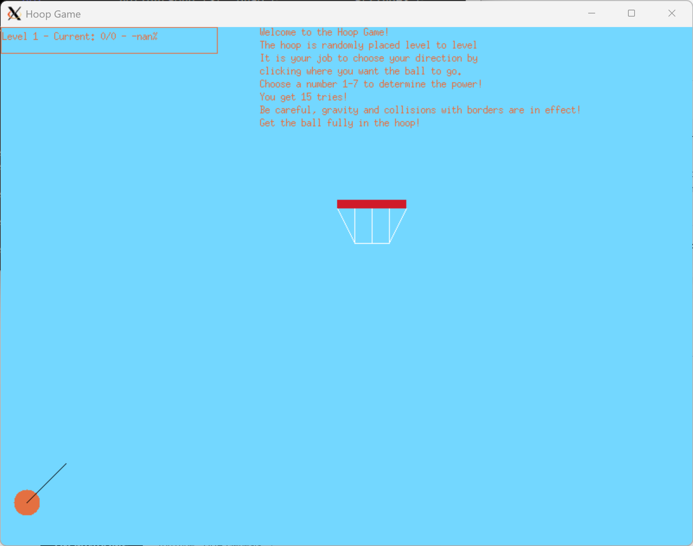

# Hoop-Game

**Hoop-Game** is a simple interactive hoop and ball game developed as part of my Fall 2024 Fundamentals of Computing course at Notre Dame.  
This project uses **X11 graphics** via `gfx2`. It requires an X server to render graphics, so it **only runs correctly when launched over SSH with X11 forwarding enabled** (e.g., PuTTY + Xming on Windows).

---

## Table of Contents
1. [Features](#features)  
2. [Prerequisites](#prerequisites)  
3. [Installation](#installation)  
4. [Running the Game](#running-the-game)  
5. [Controls](#controls)  
6. [Screenshot (Example Output)](#screenshot-example-output)  
7. [Project Structure](#project-structure)  
8. [License](#license)

---

## Features
- Basic interactive hoop and ball game  
- Graphic output using X11 (`gfx2`)  
- Compiles with a standard C toolchain via the provided `Makefile`

---

## Prerequisites
To run the game you must have:

1. **PuTTY** — for SSH access to the remote machine  
2. **Xming** (or another X server) — to render graphics locally  
3. A working **GCC/Make** toolchain on the remote machine  

**Important:** Enable X11 forwarding in PuTTY:
- In PuTTY → *Connection → SSH → X11* → check *Enable X11 forwarding*  
- Ensure Xming is running on your local machine before connecting  
- Verify that `$DISPLAY` is set on the remote machine after login

---

## Installation
Clone the repository:
```sh
git clone https://github.com/amayard27/Hoop-Game.git
cd Hoop-Game
```

---

## Running the Game
Once connected through PuTTY with X11 forwarding and with Xming running:

1. Build the project:
```sh
   make
```

2. Launch the game:
```sh
   ./project
```

If graphics do not appear:
- Confirm Xming is running locally
- Confirm PuTTY X11 forwarding is enabled
- Check that the `$DISPLAY` environment variable is set

---

## Controls
- **Mouse** — direction
- **Number Keys** — power
- **Esc / q** — quit

---

## Screenshot (Example Output)
Below is a sample screenshot of the game when running with X11 forwarding:



---

## Project Structure
```
.
├── Makefile
├── README.md
├── gfx2.h
├── gfx2.o
├── project
├── project.c
└── images/
    └── screenshot.png
```

- `Makefile` — Build instructions
- `gfx2.*` — X11 graphics support
- `project.c` — Main game source
- `images/` — Screenshots or assets

---

## License
This project is licensed under the MIT License. See [LICENSE](LICENSE) for details.
